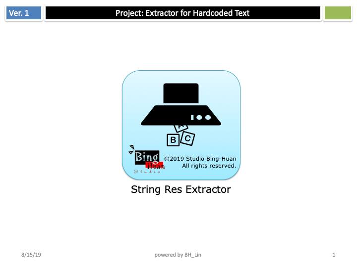
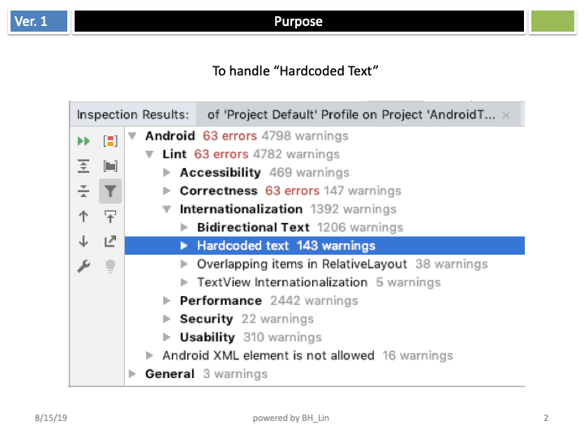
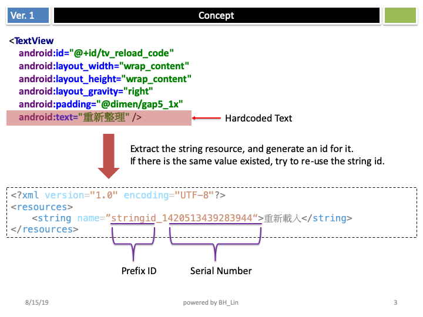
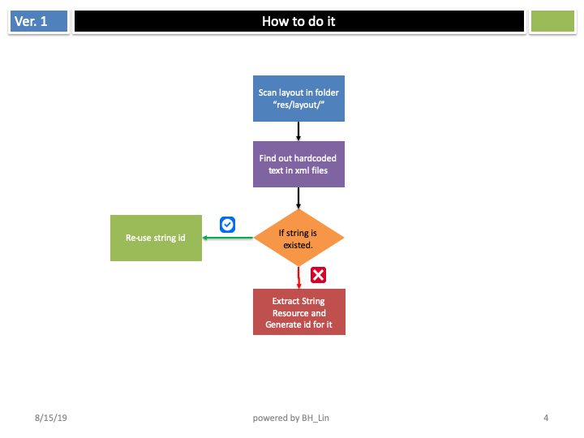
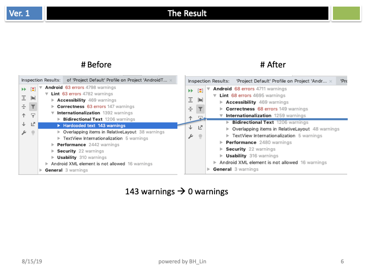

# StringResExtractor

In Android Project,   
you might have a lot of hardcoded text.   
To extract resource for all these strings might spend a lot of time.  
This is a tool for developer to clean hardcoded text easily.  

